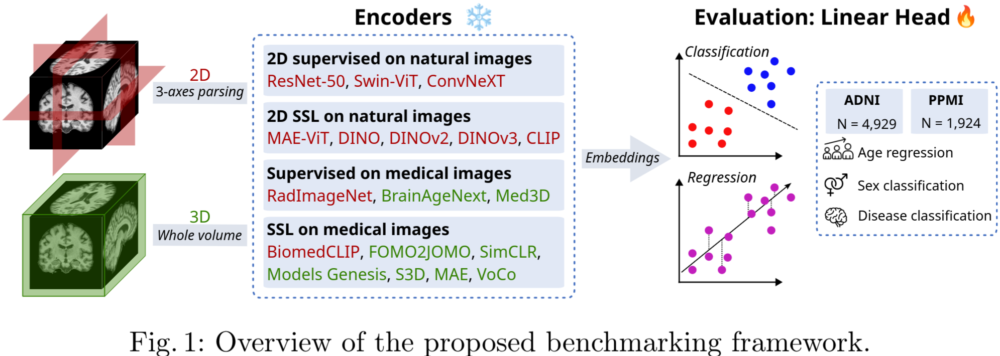
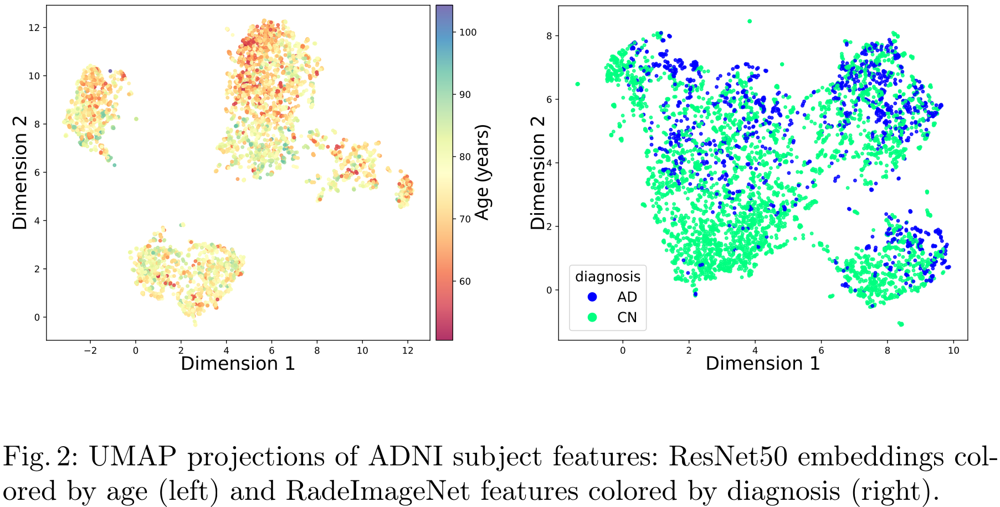
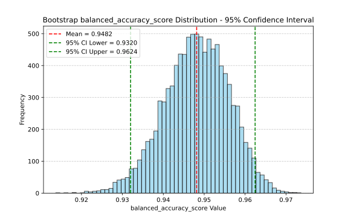
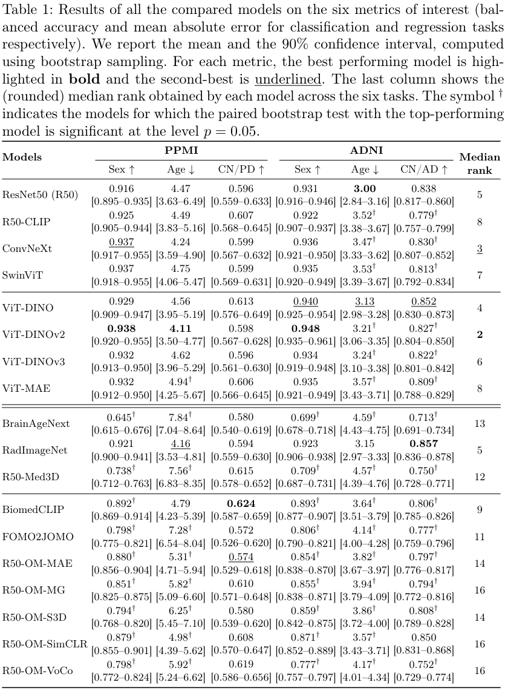

# Representation Learning for 3D Brain Imaging: A Benchmark

<!-- <br>

## Abstract -->
<br>



<br>

<div style="text-align: justify"> Many deep learning architectures for computer vision tasks
rely on features extracted by a pre-trained encoder on large databases
of natural 2D RGB images. However, the wide domain gap with medical
images hampers the direct transfer of optimized deep learning models
from computer vision to clinical applications. Recently, self-supervised
pre-training and foundation models emerged as promising alternatives
to mitigate these limitations. Yet, constructing such models for medical
imaging faces critical challenges, including designing and adapting train-
ing strategies for large 3D volume datasets, and the need for standardized
benchmarks to evaluate feature extraction performance. In this study, we
propose an extensive comparison of vision encoders with a focus on 3D
brain MRI. First, **we consider 8 fully and self-supervised models pre-
trained on natural images (e.g. ResNet, DINO, CLIP) and 10 backbone
architectures trained on medical images, either based on supervised (e.g.
RadImageNet) or self-supervised (e.g. BiomedCLIP, SimCLR) tasks.** All
pre-trained encoders are evaluated on various downstream tasks to as-
sess the representation power of their latent representations, including
**age and sex prediction as well as disease classification on the ADNI and
PPMI datasets**. Our study shows that 2D encoders pre-trained on natural
images perform the most favorably, even compared to models pre-trained
on more than 100k brain MRI volumes, highlighting the need for more
suitable and robust methods for representation learning in 3D medical
imaging. </div>

<br>

**This project led to a paper submitted and accepted at the MICCAI 2026 workshop *Machine Learning in Clinical Neuroimaging (MLCN)*.**

<br>

## Results


UMAP representation space visualisation:



Example of bootstrap results of ViT-DINOv2 for sex classification on ADNI, with 95% confidence interval:



Benchmark results:




<br>

## Project Structure


```
├── results                <- bootstrap results
│
├── src                    <- Source code
│   └── representation_benchmark_project  <- Package directory
│       │
|       ├── configs              <- Hydra configs
|       │   ├── data             <- Data configs 
|       │   ├── transforms       <- Set the basic transforms applied on raw volumes
|       │   ├── extras           <- Extra utilities configs
|       │   ├── hydra            <- hydra configs
|       │   ├── local            <- Local configs, to set the data path
|       |   ├── paths            <- Project paths configs
|       │   ├── model            <- Backbones configs 
|       │   └── task.yaml        <- main config file for eval.py
│       │
│       ├── data                     <- Data scripts
│       ├── models                   <- Model scripts
│       ├── utils                    <- Utility scripts
│       ├── eval.py                  <- main evaluation script
│       ├── experiement.py           <- Experiment utilities (split, bootstrap, etc.)
│       ├── gather_results.py        <- sumarizes results and does stat tests
│       ├── latent_space_visu.py     <- visualization of representation space
│       └── medians.py               <- compute median ranks
│
├── submodules                <- code for fomo2jomo and weights default location
├── .gitignore                <- List of files ignored by git
├── README.md
└── uv.lock                   <- Lock file specifying the exact versions of dependencies in uv environment
```


<br>

## Installation


The Python package and project manager used is [uv](https://docs.astral.sh/uv/).
Install it (on Linux and macOS) by running:

```bash
curl -LsSf https://astral.sh/uv/install.sh | sh
```

1. Download the repository.
   ```bash
   git clone https://github.com/PierreFalconnier/mri-representation-learning.git
   cd mri-representation-learning
   ```
2. Create a virtual environment and install the project and its dependencies.
   ```bash
   uv sync 
   ```
   If needed, install a specific version of torch with the correct cuda/cpu version for your system (see https://pytorch.org/get-started/locally/) using the command `uv add` instead of `pip install`. Also use `uv add` to install potential missing libraries.

3. Activate the virtual environment created by `uv`.
   ```bash
   source .venv/bin/activate
   ```


#### Additional Dependencies  
To use backbones from [FOMO2JOMO](https://github.com/jbanusco/fomo25/releases/tag/v1.0.0) and [RadImageNet](https://drive.google.com/file/d/1RHt2GnuOYlc_gcoTETtBDSW73mFyRAtR/view), their weights must be obtained from their official repo.  


<br>

## How to run

1. Download data and metadata. Use your custom dataset and dataloader classes or have a look at `src/representation_benchmark_project/data/dataset.py`.
2. Modify default config values if necessary, in yaml files or on the fly in the CLI. For example the data location in `configs/local/default.yaml`.
3. Run an evaluation for a given encoder, task and dataset:
```
uv run python -u src/representation_benchmark_project/eval.py \
    model="resnet50" \
    target_key="diagnosis" \
    data="adni" \
    data.num_workers="5" \
    data.batch_size="64"
```


**Dataset links:**  

Both PPMI and ADNI can be accessed on [https://ida.loni.usc.edu](https://ida.loni.usc.edu).


<br>

## Citation

To be added.  
